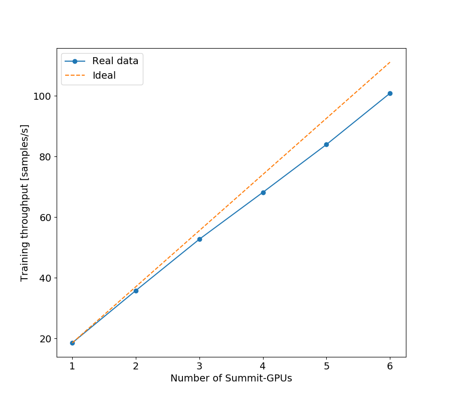
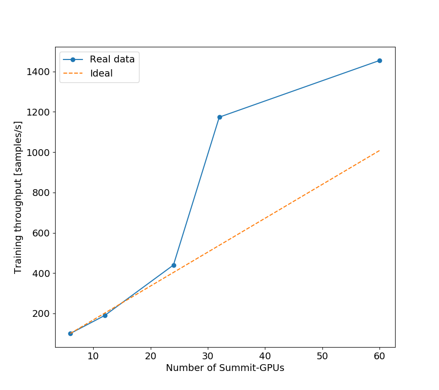
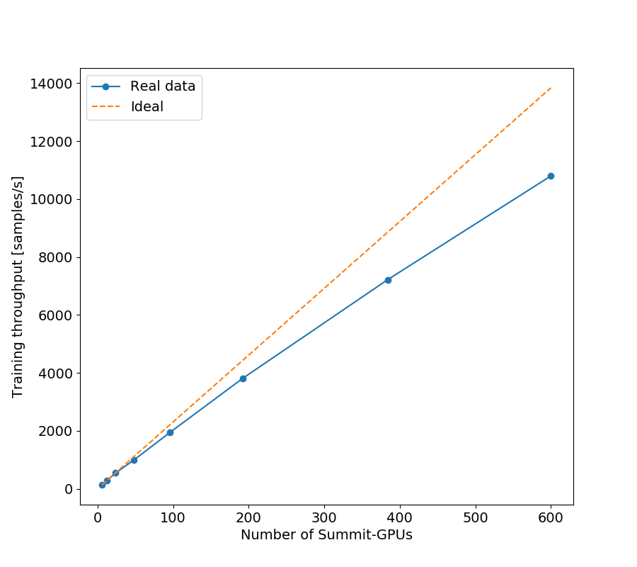
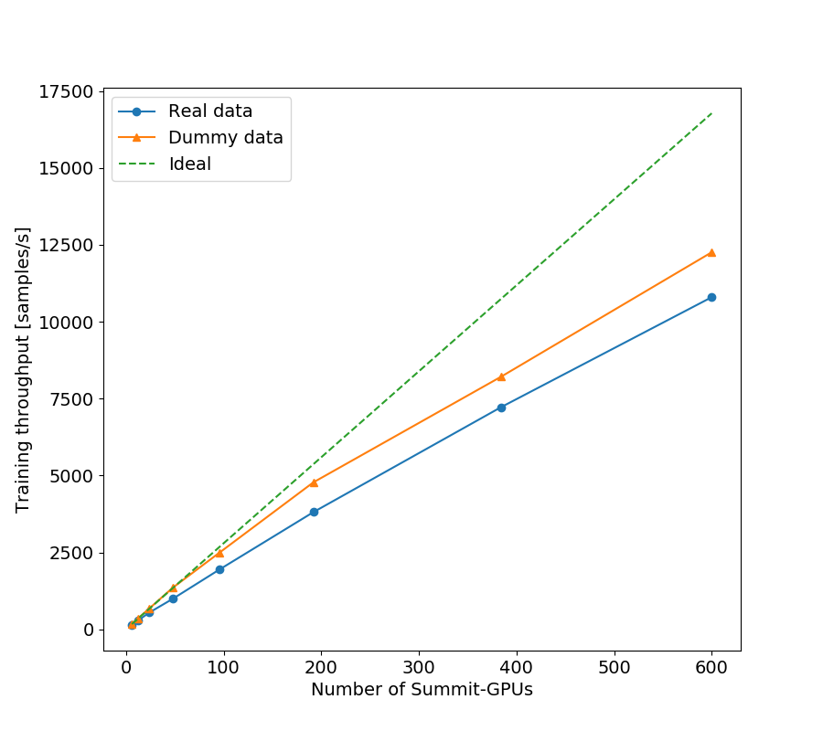

# Summit Logs
To reproduce them use `summit_scripts/plot.py`

## Strong Scale on 1 node
script: `summit_scripts/sub_train_strong_1node.lsf`

## Strong Scale on multi node
script: `summit_scripts/sub_train_strong.lsf`
* In the notebook the cori--equivalent plot has different number of samples for the first point and this is what was used for ideal. This resulting in both summit and cori plot to show unphysical behavior.

## Weak Scale on multi node
script: `summit_scripts/sub_train_weak.lsf`
* In the cori--equivalent plot the first point of real data was used but not divided by 8. Here I devided by 6.

## Weak Scale on multi node
script: `summit_scripts/sub_train_weak.lsf`, `summit_scripts/sub_train_dummy_weak.lsf`
* In the cori--equivalent plot the first point of real data was used but not divided by 8. Here I use the dummy first point and I devide by 6.

